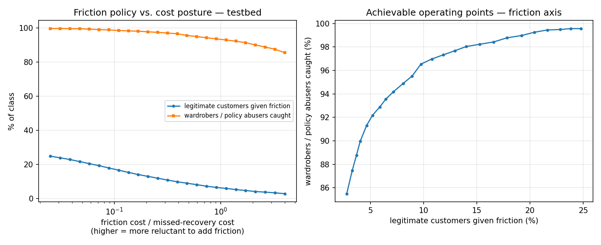

# Return-Risk Scorer

[](https://github.com/gairolarnav/Return-Risk-Scorer/actions/workflows/ci.yml)

Multiclass return-risk scorer — **legitimate / wardrobing / policy abuse /
fraudulent return** — for the Razorpay AI Risk Manager buildathon (Track 02).

Most public return-fraud tooling collapses these into a single binary
`is_fraud` flag. This project distinguishes abuse *type*, so the merchant's
response is proportionate — approve, soft friction, or hard block — rather
than uniformly punitive.

Strictly **defense-only**: the system scores and routes. It never executes an
irreversible action on a customer account.

Full design: [`docs/ARCHITECTURE.md`](docs/ARCHITECTURE.md).

---

## The headline result is a negative one

The dataset is a rule-generated synthetic set, and it is **degenerate**. Four
hand-written `if/else` rules, with **zero training**, score 0.9188 macro-F1:

```python
def rule(r):
    if r.wishlist_to_cart_time_hrs <= 5.0:
        return 'Wardrobing' if r.days_to_return >= 25 else 'Fraudulent Return'
    return 'Policy Abuser' if r.return_rate_pct > 15 else 'Legitimate'
```

| | accuracy | macro-F1 |
|---|---|---|
| Always-predict-Legitimate strawman | 0.6954 | 0.2051 |
| Hand-written rules, no model at all | 0.9425 | 0.9188 |
| LightGBM, all features | 0.9995 | **0.9988** |

Rule-baseline row regenerated by `src.model.rule_baseline_metrics()` ->
`runs/baseline_rule.json`.

A gradient-boosted model on this data is not detecting return abuse. It is
**reverse-engineering the generator**, which drew each class's features from
near-disjoint bounded ranges. Reporting 0.998 as an achievement would be the
easiest claim on earth for a panelist to dismantle.

The full account, including the three corrections this forced to the
original design, is in **[`docs/LEAKAGE_FINDING.md`](docs/LEAKAGE_FINDING.md)**.
That document is the most important thing in this repository.

---

## Three corrections worth reading

**0. The leakage gate itself was wrong on a 4-class target.** A depth-1
decision tree per feature — as originally specified — caps at ~0.45
macro-F1 no matter how perfectly a feature encodes the label, because one
split can only address two of four classes. It let `abuse_label` (a 1:1
encoding of the target) through at 0.393. Fixed by fitting at
`max(2, n_classes - 1)`, with the depth-1 number still reported alongside so
the correction is auditable (`src/data_gate.py`).

**1. The cost-calibration centerpiece was invalidated, not merely caveated.**
A cost posture can only change a decision for a row near a decision boundary.
On the full model, 99.9% of predictions sit above p=0.99 — so sweeping
`C_fp : C_fn` across three orders of magnitude produces *byte-identical*
decisions. The false-block rate is 0.00% flat; fraud-blocked is 100.00% flat.
`src/evaluate.py` carries an explicit degeneracy detector so a flat sweep is
reported as a finding rather than passing unnoticed.

**2. Even where the sweep does move, it was the wrong axis.** It assumed the
decisive tension was blocking an honest customer vs. letting fraud through.
It isn't — **Fraudulent Return is the easiest class to separate.** Of 592
genuinely ambiguous test rows, only 14 involve it; 342 are Legitimate vs.
Policy Abuser (`src.evaluate.ambiguous_class_pairs()` ->
`runs/ambiguity_testbed.json`). The real tension is the **approve ↔
soft-friction** boundary, and it moves by an order of magnitude:

| across the posture range | span |
|---|---|
| legitimate customers given friction | **2.78% → 24.79%** |
| wardrobers / policy abusers caught | **85.49% → 99.57%** |



That curve is the deliverable: it hands a merchant the achievable menu instead
of picking a threshold for them. It is also selectable at the point of use —
`scripts/score.py --friction` moves along it:

```bash
python -m scripts.score --csv examples/sample_returns.csv --track testbed \
    --friction "recovery-first (1:20)"   # 22.4% of legitimate customers frictioned, 99.4% of abusers caught
python -m scripts.score --csv examples/sample_returns.csv --track testbed \
    --friction "approve-first (4:1)"     #  2.9% frictioned, 85.7% caught
```

On the full 12,000-row test set those two postures disagree on 1,219 and 764
decisions respectively. `--posture`, which sweeps `C_fp : C_fn`, disagrees on
**29** — and on `--track full` both flags change nothing at all, which is the
leakage finding restated at the command line. The CLI prints that caveat itself
rather than leaving a reviewer to infer it from identical output.

---

## Dual-track build

Because no principled cut point exists in the ablation ladder (performance
degrades smoothly from 0.999 to 0.858), the build runs two explicitly-labelled
tracks and never blurs them:

| track | macro-F1 | rows a cost sweep can move | what it is |
|---|---|---|---|
| `full` | 0.9988 | 0.0% | **The honest model.** Reported with the leakage finding and its flat sweep. |
| `testbed` | 0.8967 | 17.4% | **Not a model.** A deliberately handicapped variant so the decision layer has a non-degenerate region to demonstrate on. |

The testbed is never presented as a result. "We dropped features until the task
got hard" is not a modelling achievement, and the repo says so out loud.

---

## Quickstart

```bash
git clone https://github.com/gairolarnav/Return-Risk-Scorer.git
cd Return-Risk-Scorer

# Hook path is local config, so it does not survive a clone — set it once here.
# .githooks/commit-msg strips agent attribution trailers; see Tests.
git config core.hooksPath .githooks

python3.11 -m venv venv && source venv/bin/activate
# macOS on Apple Silicon — LightGBM installs but fails at import without this:
brew install libomp
pip install -r requirements.txt

# place the Kaggle CSV at data/raw/returns.csv, then:
python -m src.data_gate    # customer viability, split strategy, leakage sweep
python -m src.features     # engineered features + temporal train/test split
python -m src.ablation     # the degeneracy ladder
python -m src.model        # trains both tracks
python -m src.evaluate     # per-class metrics, confusion, PR curves, cost sweeps
python -m src.explain      # per-class SHAP, both tracks -> runs/shap_*.{json,png}
python -m src.smote_experiment  # SMOTE vs class-weighted on testbed -> runs/smote_testbed.json
python -m src.segment_audit     # segment FPR by order-value bucket -> runs/segment_fpr_*.{json,png}

# score a record or a batch CSV (replaces the cut Streamlit demo — see Status)
python -m scripts.score --record-file examples/record.json --track full
python -m scripts.score --csv examples/sample_returns.csv --out scored.csv
```

Dataset: [E-Commerce Return Abuse Detection](https://www.kaggle.com/datasets/sarveshchhetri/e-commerce-return-abuse-detection-dataset)
(Kaggle, synthetic, 60,000 × 35).

**The scoring step needs no dataset and no training run.** `runs/model_full.joblib`
and `examples/` are committed, so the two commands above work directly after
`pip install`. Everything above them does need the Kaggle CSV; each stage checks
its inputs up front and prints the command that produces them rather than a
stack trace. See [`examples/README.md`](examples/README.md).

## Method notes

- **Split is temporal on `return_date`**, not `order_date`. The label describes
  the return, so that is when it materialises and when a deployed scorer would
  see the record. Splitting on `order_date` leaves 1,399 training rows whose
  outcome falls inside the test window.
- **`abuse_label` is dropped** — it is a 1:1 integer encoding of the target.
  The gate as originally specified (a depth-1 tree) *passed* it, because one
  split cannot address four classes. Corrected to depth `n_classes - 1`, with
  the depth-1 number still reported so the correction is auditable.
- **Ablation removes derived proxies too.** `returns_per_order` is
  `return_rate_pct / 100`; `orders_kept_lifetime` reconstructs
  `total_returns_lifetime`. An ablation that leaves an algebraic restatement of
  what it removed measures nothing — the first version of the ladder was a
  near-flat no-op for exactly this reason.
- **Decision rule is expected-cost minimising**, not argmax:
  `argmin_a Σ_c p(c)·C[c,a]`.
- `RANDOM_STATE = 42` everywhere.

## Tests

```bash
pytest -q                             # 106 tests
ruff check src/ scripts/ tests/
```

Every test runs on committed fixtures — a suite that needs the Kaggle CSV
could never run in CI or on a reviewer's machine.

Coverage focuses on the claims that would be expensive to get silently wrong:

- **The decision layer**, where a wrong cost matrix produces plausible-looking
  numbers that are simply false — cost-cell placement, Bayes optimality,
  monotonicity in `C_fp`, the oracle lower bound, and the degeneracy detector
  firing on saturated probabilities.
- **The rule baseline**, whose 0.9188 macro-F1 is the headline finding. The
  four thresholds are pinned branch by branch, so an edit to the rule fails the
  suite instead of silently falsifying every document that quotes it.
- **The serving path**, with one regression test per historical bug in
  `src/infer.py`, plus partial-record handling — a caller who omits a field
  gets a scored result that names what was missing, not a library traceback.
- **The invariants**: no `abuse_label` in the feature matrix, train/test
  disjoint and ordered in time, no ablation rung retaining an algebraic
  restatement of a feature it drops, and no module importing a generative or
  LLM library.

## Repository layout

```
src/data_gate.py   Day 1 gate: customer viability, split strategy, leakage sweep
src/features.py    feature engineering + FULL / TESTBED track definitions
src/ablation.py    the degeneracy ladder
src/model.py       trains either track; strawman recorded alongside
src/evaluate.py    honest metrics + cost-calibrated decision policy
src/infer.py       single-record + batch scoring -> recommended intervention
src/explain.py     per-class SHAP, both tracks
src/smote_experiment.py  SMOTE vs class-weighted on testbed
src/segment_audit.py     segment-level FPR by order-value bucket
scripts/score.py   CLI: score a record or CSV, --track, --posture, --friction
examples/          one record + a 20-row CSV, so the CLI runs with no dataset
notebooks/         presentation only, imports from src, holds no logic —
                    01_eda, 02_feature_engineering, 03_modeling, 04_cost_calibration
docs/              ARCHITECTURE.md   full design + correction log
                    LEAKAGE_FINDING.md  the headline result — read this first
                    DATA_NOTES.md     Day 1 gate findings (generated)
                    EVALUATION.md     per-class metrics, both cost axes, caveats
                    PITCH.md          5-minute pitch script
runs/              metrics JSON, charts, cost-sweep CSVs, model_full.joblib
```

Suggested reading order: this README → `docs/LEAKAGE_FINDING.md` →
`docs/EVALUATION.md` → `docs/ARCHITECTURE.md`.

## Status

Checked against what is in the repository, not against what was planned. The
two open items are listed as open rather than quietly dropped.

**Pipeline**

- [x] Day 1 data gate — customer viability, split strategy, leakage sweep
      (`docs/DATA_NOTES.md`)
- [x] Temporal train/test split on `return_date`, with the `order_date`
      alternative measured and rejected
- [x] Degeneracy ablation ladder (`runs/ablation_ladder.md`)
- [x] Dual-track build, `full` and `testbed`, never blurred
- [x] Cost-calibrated decision layer, both sweep axes, degeneracy detector

**Analysis**

- [x] Per-class precision/recall/F1, confusion matrices, PR curves — both
      tracks (`docs/EVALUATION.md`)
- [x] Per-class SHAP on both tracks, with a written reading of *why* the
      confusable classes confuse (`runs/shap_interpretation.md`)
- [x] SMOTE tested against the class-weighted baseline, with a keep/discard
      verdict decided by criteria fixed before the result
      (`runs/smote_verdict.md` — verdict: discard)
- [x] Segment-level FPR audit by order-value bucket
      (`runs/segment_fpr_audit.md`)
- [x] Measured failure-mode disclosure, plus the synthetic-data and
      task-triviality caveats stated at full strength

**Delivery**

- [x] `scripts/score.py` CLI — single record or batch CSV, `--track`,
      `--posture` (the inert axis) and `--friction` (the live one). The planned
      Streamlit demo was cut; see the correction log in `docs/ARCHITECTURE.md` §11
- [x] Four presentation notebooks, executed in place, importing from `src`
      and holding no logic of their own
- [x] `docs/ARCHITECTURE.md` reconciled — three corrections folded in, §10
      checklist honest
- [x] 5-minute pitch script (`docs/PITCH.md`)
- [x] Clean-clone into a fresh venv, Quickstart run verbatim — fully
      reproducible; every regenerated number matched, only artifact
      timestamps differed
- [x] `pytest -q` green (106 tests), `ruff check src/ scripts/ tests/` clean
- [x] MIT licence
- [ ] **Open:** 5-minute pitch *video*. `docs/PITCH.md` is the script;
      nothing has been recorded.

**Stated limitations of the build itself** (as opposed to the dataset):
hyperparameters are fixed rather than tuned and there is no validation split —
the reasoning is in `docs/ARCHITECTURE.md` §5.3 and repeated in
`docs/EVALUATION.md`. The ablation ladder scores eight feature sets against
the same temporal test split, so `testbed`'s selection criterion was read off
that split; this is why `testbed` is labelled a diagnostic rung and never a
result.

## Limitations

Stated up front rather than discovered by a reviewer: the dataset is fully
synthetic and, as shown above, close to trivially separable. Every absolute
number here is a proof of concept against synthetic ground truth, not a claim
about real merchant data — where these distributions overlap heavily and no
threshold on "hours from wishlist to cart" cleanly separates a wardrober from
an honest customer.
